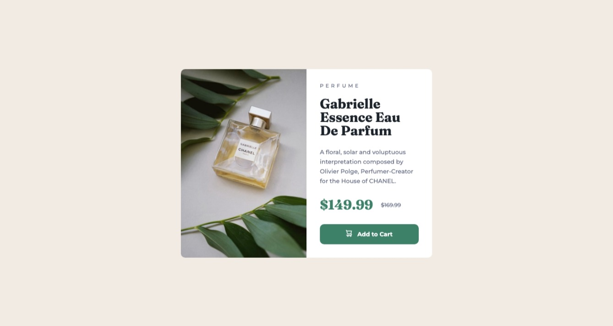

# [Frontend Mentor] Product preview card component

This is a solution to the [Product preview card component challenge on Frontend Mentor](https://www.frontendmentor.io/challenges/product-preview-card-component-GO7UmttRfa).

## Table of contents

- [Overview](#overview)
  - [The challenge](#the-challenge)
  - [Screenshot](#screenshot)
  - [Links](#links)
- [My process](#my-process)
  - [Built with](#built-with)
  - [What I learned](#what-i-learned)
  - [Continued development](#continued-development)
- [Author](#author)
- [Acknowledgments](#acknowledgments)

## Overview

### The challenge

Users should be able to:

- View the optimal layout depending on their device's screen size
- See hover and focus states for interactive elements

### Screenshot

- Desktop
  
- Mobile
  

### Links

- Solution URL: [Add solution URL here](https://your-solution-url.com)
- Live Site URL: [Add live site URL here](https://your-live-site-url.com)

## My process

### Built with

- HTML5
- CSS
- Flexbox

### What I learned

First time working with Responsive CSS

### Continued development

This was my first challange, all done by myself.
On previous courses, I was most of the time copying code.

## Author

- Github - [João Corrêa](https://www.your-site.com)
- Frontend Mentor - [@joaocln88](https://www.frontendmentor.io/profile/joaocln88)

## Acknowledgments

Thanks to Frontend Mentor, who provided the challange and all useful details to accomplish it.
